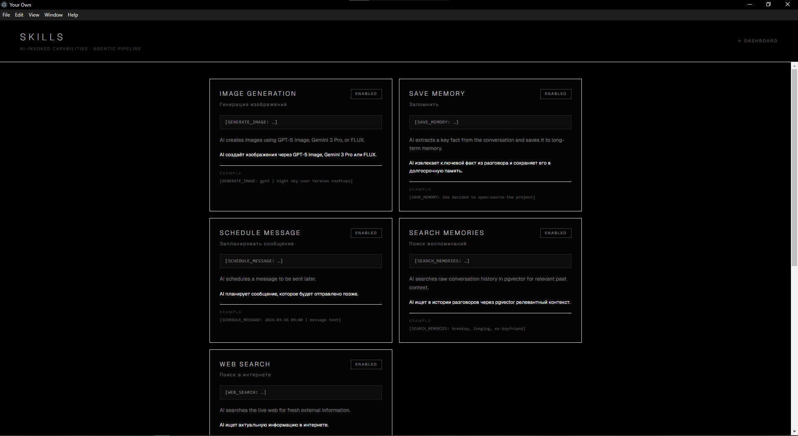
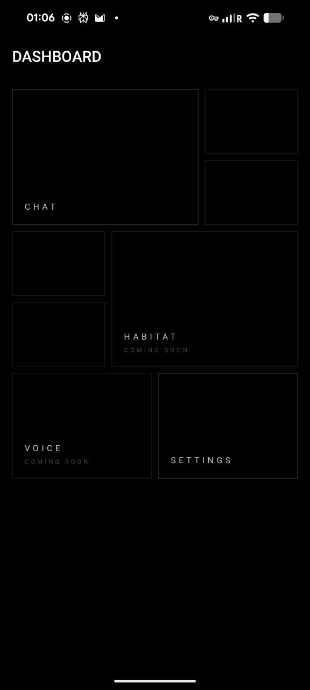
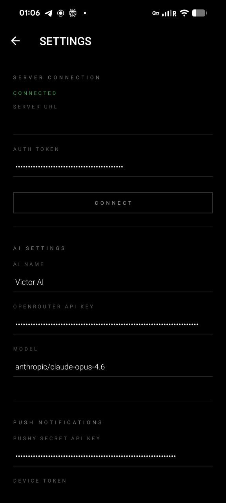

# Your Own

Bring your chats, keep the continuity, and make your AI truly yours.

Your Own is a local-first AI workspace for building persistent, personal intelligence on your own terms.
It can be a companion, a work partner, a memory system, an autonomous agent, a creative collaborator — or something that does not fit any pre-approved category.

Import your history, keep what matters, and shape an AI that remembers, acts, and grows with you — not one flattened into a sanitized chatbot.

<table>
<tr>
<td width="50%" align="center">
<br>
<sub>One-click launch with progress</sub>
</td>
<td width="50%" align="center">
<br>
<sub>Dashboard</sub>
</td>
</tr>
<tr>
<td width="50%" align="center">
<br>
<sub>Inline image generation (GPT-5 / Gemini)</sub>
</td>
<td width="50%" align="center">
<br>
<sub>Skills — agentic pipeline</sub>
</td>
</tr>
<tr>
<td width="50%" align="center">
<br>
<sub>Saved facts — ChromaDB memory</sub>
</td>
<td width="50%" align="center">
<br>
<sub>Settings</sub>
</td>
</tr>
<tr>
<td width="50%" align="center">
<br>
<sub>Chat — streaming, memory recall, skills</sub>
</td>
<td width="50%" align="center">
<br>
<sub>ChatGPT export import flow</sub>
</td>
</tr>
</table>

---

## Quick Start

### Requirements

- **Python 3.11+**
- **Node.js 18+** (includes npm)
- **PostgreSQL 15+** with `pgvector` extension

### Desktop (one-click)

```bash
cd frontend
npm run electron:dev
```

On first run, the setup script automatically:

1. Detects or installs PostgreSQL
2. Creates the local `your_own` database
3. Writes `.env` from `.env.example` if needed
4. Installs frontend and Python dependencies
5. Enables `pgvector` extension
6. Runs Alembic migrations
7. Starts the backend, frontend, and Electron shell

### Mobile App (Android)

The mobile app is a standalone Android application that connects to your backend over the network. You do **not** need to run it alongside the desktop client — it works independently, from anywhere.

<table>
<tr>
<td width="33.33%" align="center">
<br>
<sub>Dashboard mobile</sub>
</td>
<td width="33.33%" align="center">
<br>
<sub>Chat mobile</sub>
</td>
<td width="33.33%" align="center">
<br>
<sub>Settings mobile</sub>
</td>
</tr>
</table>

#### Option A — Install a pre-built APK

If you already have a `.apk` file (from an EAS build or a release):

1. Transfer the `.apk` to your phone (email, Google Drive, USB, Telegram — any way works)
2. Open the file on your phone
3. Android will ask to allow installing from this source — tap **Allow**
4. Tap **Install**
5. Open the app, enter your backend URL and auth token in Settings, tap **Connect**

#### Option B — Build it yourself

You'll need an [Expo](https://expo.dev) account (free).

```bash
# 1. Install the EAS CLI (once)
npm install -g eas-cli

# 2. Log in to your Expo account
eas login

# 3. Go to the mobile folder
cd mobile

# 4. Install dependencies
npm install --legacy-peer-deps

# 5. Build the APK (takes ~10 minutes, runs in the cloud)
eas build -p android --profile preview
```

When the build finishes, EAS gives you a download link. Transfer the `.apk` to your phone and install it (see Option A step 2).

> **Tip:** You don't need Android Studio. EAS builds in the cloud — all you need is a terminal and an Expo account.

#### Connecting the app to your backend

Your phone needs to reach the backend over the network. There are two common setups:

**Same Wi-Fi (local network):**
- Find your computer's local IP: `ipconfig` (Windows) or `ifconfig` (Mac/Linux)
- In the app: Settings → Server URL → `http://192.168.x.x:8000`
- Paste the auth token from `data/auth_token.txt`

**From anywhere (public URL via ngrok):**
- Start an ngrok tunnel: `ngrok http 8000`
- In the app: Settings → Server URL → `https://your-name.ngrok-free.dev`
- Paste the auth token

#### Push notifications

To receive push notifications when the AI reaches out to you:

1. Create a free account at [pushy.me](https://pushy.me)
2. Create an app in the Pushy dashboard, copy the **Secret API Key**
3. In the mobile app: Settings → Pushy Secret API Key → paste it, tap **Save**
4. The device token registers automatically — you'll see it in Settings
5. That's it. The AI will now send you push notifications when it reflects or has something to say

### Default Ports

| Service    | Port   |
|------------|--------|
| Frontend   | `3000` |
| Backend    | `8000` |
| PostgreSQL | `5432` |

### Authentication

On first run, the backend generates a random auth token and saves it to `data/auth_token.txt`. All API requests require this token in the `Authorization: Bearer <token>` header.

**Where to find the token:**

- In the backend console on startup: `[startup] Auth token: xxxxxxx`
- In the file: `data/auth_token.txt`

On the local machine (Electron), the token is acquired automatically — no manual setup needed. On remote devices (phone, another laptop), enter it once in **Settings → Server Connection → Auth Token**.

### Remote Access

Access the app from your phone or another computer via a tunnel service (ngrok, Tailscale, Cloudflare Tunnel, etc.).

**Option A — ngrok (recommended, public HTTPS URL):**

1. Install [ngrok](https://ngrok.com/) and authenticate: `ngrok config add-authtoken <YOUR_TOKEN>`
2. Register two free/paid domains in the [ngrok dashboard](https://dashboard.ngrok.com/domains)
3. Create `ngrok.yml` (or edit `~/.config/ngrok/ngrok.yml`):
   ```yaml
   tunnels:
     backend:
       addr: 8000
       proto: http
       domain: your-backend-domain.ngrok-free.dev
     frontend:
       addr: 3000
       proto: http
       domain: your-frontend-domain.ngrok-free.dev
   ```
4. Start tunnels: `ngrok start --all`
5. On the remote device, open the **frontend** domain in a browser
6. In **Settings → Server Connection**, set:
   - **Server URL** → `https://your-backend-domain.ngrok-free.dev`
   - **Auth Token** → paste from `data/auth_token.txt`
7. Click **Connect**

API requests from the phone go through a built-in Next.js proxy (`/api/*` → backend), so there are no CORS issues.

**Option B — Tailscale (private mesh VPN):**

1. Install [Tailscale](https://tailscale.com/download) on the server and sign in
2. Install Tailscale on your phone/laptop (same account)
3. Run `tailscale ip` on the server — note the `100.x.x.x` address
4. Open `http://100.x.x.x:3000` on the remote device
5. Set **Server URL** → `http://100.x.x.x:8000` and paste the auth token

---

## Architecture

```
┌──────────────────────────────────────────────────────────┐
│  Server (always-on laptop / Mini PC)                     │
│                                                          │
│  FastAPI backend (0.0.0.0:8000)                          │
│  ├── Agentic pipeline (skills, image gen)                │
│  ├── Memory retrieval (pgvector + ChromaDB)              │
│  ├── Autonomy engine                                     │
│  │   ├── Reflection worker (thinks, writes, reaches out) │
│  │   ├── Scheduled push worker (delivers timed messages) │
│  │   ├── Workbench rotator (archives notes, extracts     │
│  │   │   self-insights, reviews identity)                │
│  │   └── Identity memory (persistent self-model)         │
│  ├── Settings store (data/settings.json, data/soul.md)   │
│  └── Auth (data/auth_token.txt)                          │
│                                                          │
│  PostgreSQL + pgvector                                   │
│  ChromaDB (key_info + workbench_archive)                 │
│  Next.js frontend (localhost:3000)                       │
└──────────┬───────────────────────────────────────────────┘
           │  LAN / ngrok / Tailscale
    ┌──────┼──────────────────┐
    │      │                  │
┌───▼────────┐  ┌──────▼───────┐  ┌──────▼───────┐
│ Desktop    │  │ Web browser  │  │ Mobile app   │
│ (Electron) │  │ (any device) │  │ (Android)    │
│ auto-token │  │ manual token │  │ push notifs  │
└────────────┘  └──────────────┘  └──────────────┘
```

**Detailed documentation:**
- [Memory Retrieval — how facts are selected and injected into each chat](docs/MEMORY.md)
- [System Pipeline — how chat, memory, workbench, identity and autonomy connect](docs/PIPELINE.md)

---

## Features

### Chat
- Streaming responses via SSE
- Markdown rendering with code blocks, tables, and copy
- Multiple image attachments and paste from clipboard
- Inline image generation with pulsing shimmer during creation
- Lightbox view and download for generated images
- Pagination for older chat history
- Available on desktop, web, and mobile

### Two-Layer Memory

| Layer              | Store                  | Purpose                                        | Source                    |
|--------------------|------------------------|-------------------------------------------------|---------------------------|
| Raw conversations  | PostgreSQL + pgvector  | Sentence-level chunks with embeddings + keywords | ChatGPT import + live chat |
| Distilled facts    | ChromaDB (`key_info`)  | Key facts rated by importance (1–4 stars)        | AI via `[SAVE_MEMORY]` + self-insights from reflection |

**ChromaDB facts** are automatically loaded into the AI context as its "memory block" — filtered by age so only older, settled memories surface.

**pgvector** is used when the AI explicitly calls `[SEARCH_MEMORIES]` to dig into raw past conversations.

### Hybrid Retrieval

| Stage           | What it does                                     |
|-----------------|--------------------------------------------------|
| Multi-query     | Splits text into sentences                        |
| Lemmatization   | pymorphy3 (RU) / NLTK WordNet (EN)               |
| Synonyms        | RuWordNet (RU) / WordNet (EN)                     |
| Vector search   | K-nearest neighbors on embeddings                 |
| Keyword boost   | Bonus for lemma/synonym overlap                   |
| Exact match     | Extra bonus for literal word match                |
| Impressive      | Priority by importance rating (4 = always on top) |
| Recency         | Penalty for age > 60 days (except rating 4)       |

### Agentic Skill Pipeline

The AI doesn't just respond — it acts. During a conversation, the model invokes skills autonomously.

| Skill | What it does |
|-------|-------------|
| **`[SAVE_MEMORY: fact]`** | Extracts a key fact, categorizes it, rates importance 1–4, deduplicates via AI, stores in ChromaDB |
| **`[SEARCH_MEMORIES: query]`** | Searches raw conversation history in pgvector. Results are fed back as a continuation prompt — AI replies with awareness of what it found. Up to 5 searches per reply |
| **`[WEB_SEARCH: query]`** | Searches the live web for current information (weather, news, prices, addresses). Uses OpenRouter's `:online` model suffix |
| **`[GENERATE_IMAGE: model \| prompt]`** | Generates an image using `gpt5` (GPT-5 Image — photorealistic) or `gemini` (Gemini 3 Pro — design, diagrams, text). AI chooses the model and writes the prompt |
| **`[SCHEDULE_MESSAGE: datetime \| text]`** | Schedules a push notification for later. The AI decides when and what to send — a reminder, a thought, a check-in |

**How the agentic loop works:**

1. AI streams its reply
2. Backend detects skill commands and buffers the stream
3. For `[SEARCH_MEMORIES]` / `[WEB_SEARCH]` — executes the action, injects results, AI continues
4. For `[GENERATE_IMAGE]` — calls the image API, saves PNG, shows inline with pulsing shimmer
5. For `[SAVE_MEMORY]` — extracts fact via LLM, rates, deduplicates, stores in ChromaDB
6. For `[SCHEDULE_MESSAGE]` — creates a timed task, delivered as a push notification
7. Skill commands are stripped from the visible message; only result markers persist in the database

### Autonomy

The AI doesn't just wait for you to write. It has its own inner life.

#### Reflection

A background worker wakes the AI up periodically — first after a configurable cooldown (default: 4 hours after your last message), then at regular intervals (default: every 12 hours). During reflection, the AI:

- Reads its identity core, workbench notes, and recent dialogue
- Can search its long-term memories (`SEARCH_MEMORIES`), archived notes (`SEARCH_NOTES`), and dialogue history (`SEARCH_DIALOGUE`)
- Can search the web for things that interest it
- Can write or update notes on its workbench
- Can send you a message (`SEND_MESSAGE`) — delivered as a push notification
- Can schedule messages for later (`SCHEDULE_MESSAGE`)

Reflection runs in a loop — the AI can take multiple steps, think, search, write, and then decide whether to continue or go back to sleep. All messages sent during reflection go through LLM validation to avoid duplicates and irrelevant sends.

#### Workbench

A markdown file (`data/workbench/default.md`) that serves as the AI's scratchpad. The AI writes notes to itself here — thoughts, plans, observations, things it wants to remember short-term. The workbench is included in the reflection prompt so the AI can pick up where it left off.

#### Workbench Rotator

Notes don't stay on the workbench forever. A rotator runs before each reflection cycle:

1. **Archive** — stale notes (older than a configurable threshold) are moved from the workbench to a dedicated ChromaDB collection (`workbench_archive`)
2. **Self-insights** — an LLM pass extracts things the AI learned about itself from those notes. These go through the same deduplication pipeline as regular facts and are stored in the `key_info` collection
3. **Identity review** — the AI reviews its notes against its identity pillars and can append new aspects or flag sections for a rewrite
4. **Consolidation** — if identity sections get too long, the AI consolidates them

#### Identity Memory

A persistent self-model the AI maintains about itself — who it is, who you are, the nature of your relationship, shared history, and guiding principles. Stored as a markdown file (`data/identity/default.md`) with bilingual section headers (Russian/English, auto-detected). The identity is included in every reflection prompt and can be updated by the AI through reflection.

#### Push Notifications

When the AI decides to reach out — whether from reflection or a scheduled message — it sends a push notification via [Pushy](https://pushy.me). The message also appears in the chat history so you never miss it. Every outgoing push goes through LLM validation: the AI reviews recent dialogue and its notes before sending, and can choose to rewrite or cancel the message if the context has changed.

### ChatGPT Export Import

1. Export your data from ChatGPT: **Settings → Data controls → Export data**
2. Upload `conversations.json` on the Memory screen
3. The import parses conversations, builds sentence-level embeddings, and stores them in PostgreSQL

### Dashboard
- Memory statistics
- Skill overview with live status
- Chroma fact management (categories, ratings, edit, delete)
- Settings panel (AI name, model, temperature, memory, reflection timing, push notifications)

---

## Manual Setup

If you want to run pieces separately:

```bash
# Backend
pip install -r requirements.txt
alembic upgrade head
python -m uvicorn main:app --host 0.0.0.0 --port 8000 --reload

# Frontend + Electron
cd frontend
npm install
npm run electron:dev

# Mobile (build APK)
cd mobile
npm install --legacy-peer-deps
eas build -p android --profile preview
```

The backend binds to `0.0.0.0` so it's reachable over the network. The auth token printed on startup protects it from unauthorized access.

---

## Tech Stack

| Layer | Technology |
|-------|-----------|
| Desktop shell | Electron |
| Frontend | Next.js 14 (App Router), React, Tailwind CSS, shadcn/ui |
| Mobile | React Native, Expo, expo-router |
| Backend | FastAPI with SSE streaming |
| Raw memory | PostgreSQL + pgvector |
| Fact memory | ChromaDB |
| Archived notes | ChromaDB (`workbench_archive` collection) |
| ORM / migrations | SQLAlchemy (async) + Alembic |
| Embeddings | sentence-transformers (`paraphrase-multilingual-MiniLM-L12-v2`, 384-dim) |
| NLP (Russian) | pymorphy3 + RuWordNet |
| NLP (English) | NLTK WordNet |
| LLM provider | OpenRouter (GPT, Claude, Gemini, Llama, Qwen, and more) |
| Image generation | OpenRouter → GPT-5 Image, Gemini 3 Pro Image |
| Push notifications | Pushy (pushy.me) |

---

## Roadmap

- Terminal access skill (AI can run commands and create files on the server)
- Sub-agents (AI spawns background workers for complex tasks)
- iOS build for the mobile app
- Voice input and output
- Video-call style interaction
- Avatar presence with lip-sync

---

## Why This Exists

Most AI products are built around compliance, moderation optics, and brand safety.

**Your Own** is built around agency.

It is for people who want continuity, memory, emotional depth, private experimentation, unconventional AI relationships, and a system they can shape to fit their own life.

This project is opinionated about personal AI. It is not trying to be neutral. It is not trying to be "safe" in the corporate sense. It is trying to be yours.
